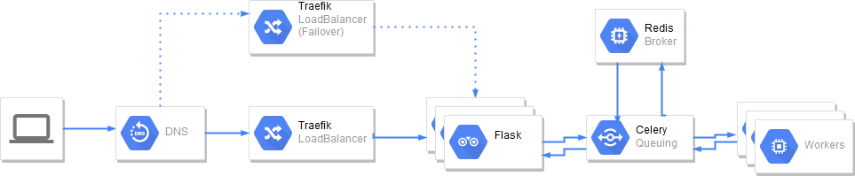

Dockerized Asynchronous REST API w/ Traefik, Flask, Celery (Redis)
================================================================== 




Usage
------

Up & Running

```
docker-compose build
docker-compose up
```

Use REST API

```
curl -H Host:host.localhost.com http://localhost:80/factors/24
```

Scale web nodes

```
docker-compose scale web=x ; New backends are now shown on http://localhost:8080/
Scale worker nodes

```
docker-compose scale worker=x ; New backends are now shown on http://localhost:5555
```

URLs
-----

*	API Endpoint: http://localhost:80/factors/<int>
*	Traefik dashboard: http://localhost:8080
* Monitoring Task queue: http://localhost:5555

Requirements
-------------

* docker
* docker-compose

**Tested with:**

``` 
Docker
Client:
Version:      17.06.0-ce
API version:  1.30
Go version:   go1.8.3
Git commit:   02c1d87
Built:        Fri Jun 23 21:20:04 2017
OS/Arch:      linux/amd64
Server:
Version:      17.06.0-ce
API version:  1.30 (minimum version 1.12)
Go version:   go1.8.3
Git commit:   02c1d87
Built:        Fri Jun 23 21:18:59 2017
OS/Arch:      linux/amd64
Experimental: false
```

```
docker-compose version 1.22.0, build f46880fe
docker-py version: 3.4.1
CPython version: 3.6.6
OpenSSL version: OpenSSL 1.1.0f  25 May 2017
```
